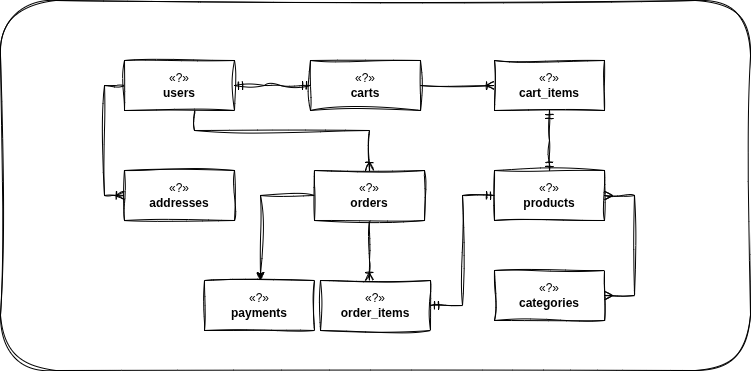
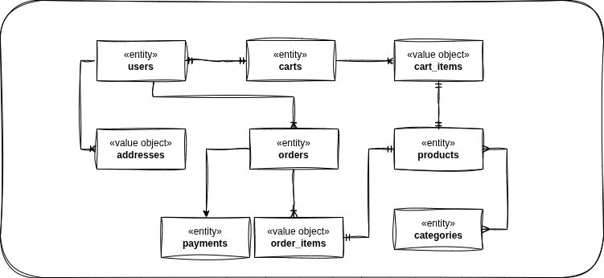
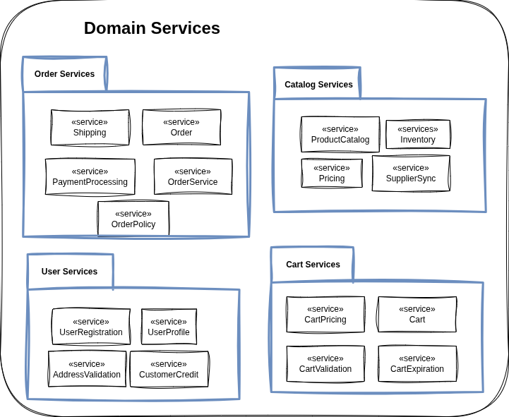
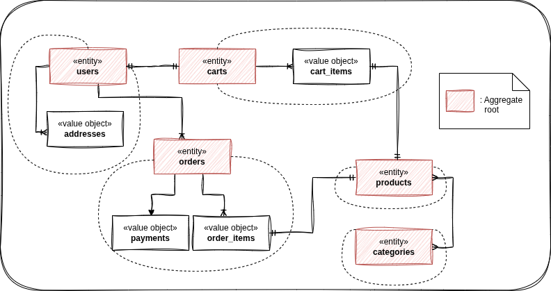
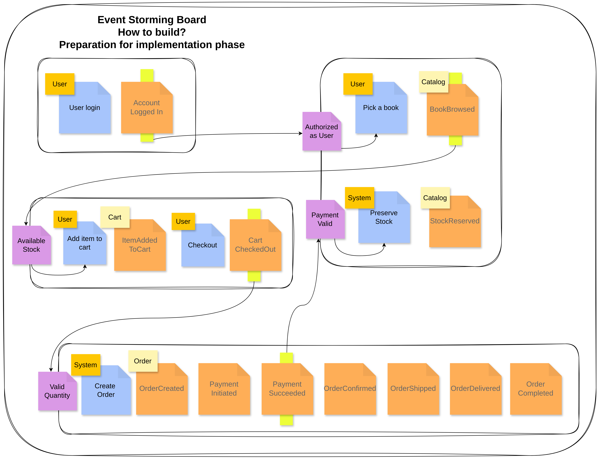

# **Domain-Drivent Design**
Tackling complexity in the heart of software

---
# **Outline**
1. First look
4. Core concept of DDD
5. Model-driven Design
6. Subdomain
7. Event Storming
8. Tóm tắt
---
# **First look**

---

# **Domain-Driven Design là gì ?**

> Domain-driven design (DDD) is a modeling technique that allows for organized decomposition of complex problem domains.

_Neal Ford & Mark Richards. 
\- Fundamentals of Software Architecture 2020._

---

# **Tại sao lại cần tới DDD?**

- Với một domain phức tạp bạn không thể cứ thế lao vào, đâm đầu lập trình hệ thống
- Điều đầu tiên là hiểu domain
- Nhưng Domain quá phức tạp

&rarr; Hãy phân tích, phân rã thành từng phần nhỏ và cấu trúc các phần ấy lại.

--- 
# **Những ai sẽ cần phải hiểu Domain?**
- Team phân tích yêu cầu
- Team thiết kế 
- Team lập trình. 

&rarr; Tất cả moi người làm việc trong quá trình phát triển phần mềm.
 
Hơn nữa, việc hiểu về domain cần sự kết nối giữa các đội ngũ với nhau. Nói kĩ hơn ở phần sau.

---

# **Core concept of DDD**
1. Domain
2. Model & Domain Model
3. Ubiquitous Language

---

# **Domain**
> Something of this world

--- 
# **Hiểu Domain quan trọng như thế nào?**

- Trong domain, luôn có những quy tác, luật lệ (Business policies) mà người ngoài ngành không dễ biết.
- Domain rất rộng lớn, bạn sẽ không thể hiểu được trong một thời gian ngắn &rarr; Lý do có BA, có Requirement Engineer,…
- Và bạn cần phải hiểu domain để có thể làm việc với các thành viên khác trong team.

---

> It’s not the domain experts knowledge that goes to production, it is the assumptions of the developers that go to production.
— Alberto Brandolini

---

# **Hiểu Domain quan trọng như thế nào?**
- Ví dụ: 
	- Một đội ngũ bắt tay vào một dự án về Water - transportation. 
	- Với mỗi con tàu sẽ có một mức chịu tải nhất định
&rarr; Số lượng hàng hóa tối đa mà tàu có thể chứa là 100% mức chịu tải?
- Thực chất, số lượng hàng hóa tối đa mà có thể chấp nhận nên lớn hơn mức chịu tải của (over-booking).
- Mức độ cho phép quá tải được cân nhắc dựa vào nhiều yếu tố như thời tiết, tình trạng tàu...

---

# **Mọi thông tin đều quan trọng?**
- Lượng thông tin trong Domain là cực kỳ khủng khiếp, nhưng không phải thông tin nào trong domain cũng sẽ có ích
- Cần phải chắt lọc và sắp xếp kỹ càng trước khi sử dụng nó cho giao đoạn sau. Và việc này có tên là “Model the domain”

---

# **Model & Domain Model**
The Abstraction of the Domain

---
# **Model**

- **Model** là sự đơn giản hóa, có cấu trúc, được rút ra từ domain
- **Modeling** là một quá trình trừu tượng hóa domain thành các đối tượng, thuộc tính và hành vi của nó.
- Kết quả cho ra một bản Blueprint của một hệ thống
- Blueprint cũng có thể là một sơ đồ, một tài liệu hay một đoạn code

---

# **Model**
> The volume and complexity of information can be overwhelming. This is when a development team can use modeling to wrestle with that overload. A **model** is a selectively simplified and consciously structured form of knowledge. 
\- Eric Evans.

---

# **Domain Model**
> The **Domain Model** is not a particular diagram
It is the idea that the diagram is intended to convey.

---
# **Domain Model**
- **Domain** xuất phát từ thế giới thực, nhưng **Domain Model** không cần quá sát với thực tế.
- Nhìn **Domain** từ nhiều gốc độ, sẽ giúp ta hình thành nhiều **Model**, từ đó cho ta nhiều hướng đi cho việc phát triển hệ thống

---
# **Ubiquitous Language**

- Là một khái niệm cốt lõi trong DDD
- Được minh họa qua các tình huống thực tế, khi các Domain Experts làm việc chung với Developers
- Giải quyết rào cản ngôn ngữ giữa Developers và Domain Experts

---

# **Vì sao cần Ubiquitous Language?**

- Lập trình viên và chuyên gia domain có kiến thức chuyên môn khác nhau
- Khi cùng trao đổi về hệ thống, dễ phát sinh hiểu nhầm
- Domain experts dùng từ ngữ chuyên ngành của lĩnh vực họ
- Developers dùng thuật ngữ kỹ thuật của lĩnh vực CNTT

→ Dễ dẫn đến hiểu sai và phát triển sai hướng

---

# **Tầm quan trọng Ubiquitous Language**

- Cần hiểu rõ domain để thiết kế hệ thống phù hợp
- Không có "bức tranh" toàn cảnh → khó khăn trong thiết kế
- Hiểu sai &rarr; Thiết kế sai → Code sai
- Tạo kênh giao tiếp hiệu quả giữa các thành viên
- Lấy **Model** làm trung tâm trong mọi cuộc trao đổi

---

# **Nếu thiếu Ubiquitous Language**

Nếu hai bên không có ngôn ngữ chung:
- Hiểu khái niệm theo cách riêng của mỗi bên
- Thiếu sự nhất quán trong diễn giải
- Tiềm ẩn rủi ro cao dẫn đến mismatch trong lối tư duy về Domain

---

# **UL được hình thành như thế nào?**

> The **Model-based Language** - Ngôn ngữ dựa trên **Model**

- Bộ quy tắc về ngôn ngữ xoay quanh **Model**
- Sử dụng xuyên suốt giữa các **Developers** và **Domain Experts**
- **Ubiquitous** = có mặt ở khắp mọi nơi trong quá trình làm việc

---

# **Đặc điểm của Ubiquitous Language**

- Không bất biến, có thể thay đổi theo thời gian
- Được điều chỉnh khi phát hiện vấn đề trong quá trình sử dụng
- Cần sự tham gia của cả hai phía:
  - **Domain Experts** hiểu sâu về lĩnh vực
  - **Developers** hiểu rõ về khía cạnh kỹ thuật
- Xoay quanh **Model** - trung tâm của hệ thống

---

> Ubiquitous Language không phải là một loại ngôn ngữ, nó đại diện cho việc giao tiếp giữa các thành viên trong team với nhau. Mọi người trao đổi, xây dựng nên bộ quy tắc để giao tiếp về khái niệm **xung quanh một model**, và họ sẽ phải cam kết sử dụng các quy ước trên trong suốt quá trình làm việc.

---

# **Công cụ giao tiếp**

- **Kết hợp nhiều phương thức**:
  - UML + Documents
  - Code
  - Trao đổi trực tiếp

--- 

# **Model-driven Design**
1. Sự cần thiết của việc cùng nhau hiểu Domain
2. Structured Domain Model:
	1. **Entity**
	2. **Value Object**
	3. **Domain Service**
	4. **Aggregate**

--- 

# **Entity**
Objects with identity

---

# **Entity là gì?**

- **Objects** với định danh (identity) riêng biệt
- *Identity* phân biệt **Entity** với các objects khác, ngay cả khi attributes giống nhau
- *Identity* không thay đổi trong suốt vòng đời của **Entity**

---

# **Entity vs Memory Address**

- Không nhầm lẫn việc phân biệt objects thông qua địa chỉ vùng nhớ
- Domain không quan tâm đến "địa chỉ vùng nhớ" mà quan tâm đến định danh trong ngữ cảnh nghiệp vụ
- Giúp ta phân biệt các objects ngay cả khi thuộc tính giống nhau

---

# **Cách nhận biết Entity**

Hãy tự hỏi:
- Bản thân object có cần được phân biệt với các đối tượng cùng loại?
- Có vòng đời riêng và tồn tại lâu dài trong hệ thống?
- Có thể thay đổi thuộc tính nhưng vẫn được coi là cùng một đối tượng?

---

# **Ví dụ về Entity**

Trong shop bán sách:
- Shop có nhiều khách hàng với nhu cầu khác nhau
- Khách hàng tồn tại xuyên suốt quá trình ứng dụng hoạt động
- Khi họ chuyển đi nơi khác, chỉ địa chỉ thay đổi, họ vẫn là cùng một khách hàng

⇒ Khách hàng là một Entity

---

# **Value Object**
> Objects defined by their attributes

---

# **Value Object là gì?**

- Objects không cần định danh (identity-less)
- Chỉ quan tâm đến giá trị thuộc tính
- Có tính chất **immutable** (bất biến)
- Khi cần thay đổi, tạo mới thay vì sửa đổi

---
# **Đặc điểm của Value Object**

- Identity-less: không cần định danh
- Immutable: không thay đổi sau khi tạo
- Equality: hai value objects giống nhau nếu tất cả thuộc tính giống nhau

---

# **Cách nhận biết Value Object**

- Object không cần định danh, chỉ quan tâm tới thuộc tính
- Không cần theo dõi vòng đời của nó
- Có thể chia sẻ (sharable)

<!-- Ví dụ: Địa chỉ của một user - hai địa chỉ có thuộc tính giống nhau được xem là một -->

---

# **Vì sao cần Value Object?**

- Giảm chi phí lưu trữ
- Tăng hiệu năng của ứng dụng
- Không phải tracking mọi object
- Phân biệt đâu là Entity (cần theo dõi vòng đời) và đâu là Value Object (chỉ quan tâm thuộc tính)

---

---

---

# **Domain Service**
Business rules and operations

---

# **Domain Service là gì?**

> Domain service represents for Business Policy (Rules or Logics)

- Chứa hành động và logic không thuộc về bất kỳ Domain Objects cụ thể nào
- Đại diện cho Business Rules
- Không có state (stateless)

---

# **Cách nhận biết Domain Service**

Qua Ubiquitous Language, các động từ (verbs) gợi ý các service cần thiết:

Ví dụ: Khách hàng 'mua' sách và 'thanh toán' hóa đơn

1. **Domain Objects**: Khách hàng, sách, hóa đơn (Entity)
2. **Services**: **Mua** và **thanh toán**

---

# **Đặc điểm Domain Service**

- Stateless - không có thuộc tính/state
- Cung cấp interface với các methods
- Thường liên quan đến nhiều objects khác nhau
- Đại diện cho hành động nghiệp vụ

---

# **Vì sao cần Domain Service?**

- Tách biệt logic không thuộc về một object cụ thể nào
- Tránh "spoiled" objects (objects với quá nhiều trách nhiệm)
- Dễ kiểm soát và cài đặt các business rules
- Tổ chức rõ ràng các hành động nghiệp vụ

---

---

# **Aggregate**
Cluster of associated objects

---

# **Aggregate là gì?**

> Aggregate là một cụm các đối tượng domain liên kết logic, và được truy cập thông qua Aggregate Root duy nhất (thường là một Entity)

---

# **Đặc điểm của Aggregate**

- Giải quyết vấn đề mối quan hệ phức tạp
- Nhóm các objects liên quan thành một đơn vị
- Có một Aggregate Root (thường là Entity) làm điểm truy cập
- Giúp đảm bảo tính nhất quán (consistency)

---

# **Vì sao cần Aggregate?**

- Tổ chức và quản lý các objects có mối quan hệ phức tạp
- Đơn giản hóa các mối quan hệ hai chiều thành một chiều
- Đảm bảo tính nhất quán của dữ liệu
- Cải thiện hiệu năng và khả năng mở rộng

---

# **Ví dụ về Aggregate**

Trong shop bán sách:
- **Order** (Aggregate Root)
  - Order Items
  - Delivery Information
  - Payment Status
  
Mọi thay đổi đến order items hoặc delivery info đều thông qua Order

---

---

# **Subdomain**
*Problem-space concept*

---

# **Khi Domain vượt ngoài tầm kiểm soát**

---

# **Subdomain là gì?**

- Với hệ thống lớn (như Netflix), Domain Model trở nên cực kỳ phức tạp
- Dù refactor, chắt lọc tới đâu, model vẫn phức tạp
- Cần phân chia Domain Model thành những Subdomain nhỏ hơn
- Cần xác định rõ **Core** - trái tim của Domain

---

# **3 Loại Subdomain**

1. **Core Subdomain**
2. **Generic Subdomain**
3. **Supporting Subdomain**

---

# **Core Subdomain**
Trái tim của hệ thống

---

# **Core Subdomain**

- Chứa Business Logic trực tiếp sinh lời cho doanh nghiệp
- Thể hiện được sự khác biệt của hệ thống
- Trực tiếp đóng góp vào lợi thế cạnh tranh
- Nên được hình thành qua quá trình phân tích và thiết kế

---

# **Phát triển Core Subdomain**

- Nên được giao cho Developer trình độ cao
- Tách biệt thành module riêng 
- Cần đầu tư nhiều nguồn lực và thời gian
- Ưu tiên phát triển và tối ưu hóa

---

# **Generic Subdomain**
Lời giải có sẵn

---

# **Generic Subdomain**

- "Lời giải có sẵn cho một vấn đề"
- Cần thiết nhưng không phải là trung tâm của hệ thống
- Có nhiều giải pháp sẵn có trên thị trường
- Ví dụ: xuất hóa đơn, xử lý payment, authentication

---

# **Đặc điểm Generic Subdomain**

- Common functionalities - chức năng phổ biến
- Không tạo ra lợi thế cạnh tranh trực tiếp
- Có thể sử dụng giải pháp bên thứ ba
- Không cần đầu tư quá nhiều tài nguyên phát triển

---

# **Supporting Subdomain**
Hỗ trợ cho Core

---

# **Supporting Subdomain**

> The business creates a **Supporting Subdomain** because ***it is somewhat specialized***. Being Supporting or Generic doesn't mean unimportant. These kinds of Subdomains are ***important to the success of the business***, yet there is ***no need for the business to excel in these areas***.
\- *Vaughn Vernon*

---

# **Đặc điểm Supporting Subdomain**

- Được doanh nghiệp tự implement vì không có sẵn
- Hỗ trợ cho Core Subdomain hoạt động ổn định
- Không cần phải xuất sắc như Core Domain
- Quan trọng nhưng không tạo ra lợi thế cạnh tranh trực tiếp

---

# **So sánh các loại Subdomain**

| Subdomain | Tầm quan trọng | Tạo sự khác biệt | Giải pháp |
|-----------|----------------|------------------|-----------|
| Core | Cao | Có | Tự phát triển |
| Generic | Cao | Không | Có sẵn |
| Supporting | Cao | Không | Tự phát triển |

---

# **Tóm tắt**

- **Core Subdomain**: Trái tim của hệ thống, tạo nên sự 
khác biệt và lợi thế cạnh tranh
- **Generic Subdomain**: Quan trọng, không tạo sự khác biệt, có sẵn giải pháp
- **Supporting Subdomain**: Quan trọng, hỗ trợ cho Core, không có sẵn giải pháp

---

# **Event Storming**

> What's happening in the domain?

---

# **Giới thiệu**

- Event Storming là một phương pháp workshop để khám phá và hiểu domain.
- Được áp dụng xuyên suốt quá trình phân tích, không phải chỉ ở đầu dự án.
- Giúp trả lời: **"How are we gonna build it?"**

---

# **Công cụ cần thiết**

- Bút, bảng trắng, giấy trắng, giấy nhớ...
- Chủ yếu là teamwork và trao đổi!

---

# **1. Extract Domain Events**

- **Domain Event** là những gì đã xảy ra trong domain mà domain experts quan tâm.
- Đặt câu hỏi: **"What just happened?"**
- Chỉ cần xác định sự kiện đã xảy ra, chưa cần biết khi nào.

---

# **Ví dụ Domain Events**

Mini book shop:
- BookAddedToCart
- CartCheckedOut
- OrderCreated
- PaymentSucceeded
- OrderDelivered

---

# **2. Setting up Commands**

- **Command** là hành động gây ra thay đổi trong hệ thống (side effect).
- Command là tác nhân sinh ra domain event.
- Được gọi từ user hoặc hệ thống bên ngoài.

---

# **Ví dụ Command**

- Event: *BookAddedToCart*
- Command: *AddBookToCart* (người dùng thêm sách vào giỏ)

---

# **3. Find Aggregate**

> An aggregate is a cluster of associated objects that we treat as a unit for the purpose of data changes."

- Aggregate đảm bảo các thay đổi tuân theo business rules.
- Mỗi Aggregate có một **Aggregate Root**.

---

# **Ví dụ Aggregate**

- Đơn hàng (Order) là Aggregate, Order là Aggregate Root.
- Các mục đơn hàng chỉ được chỉnh sửa thông qua Order.
- *BookAddedToCart* thuộc về Aggregate Cart.

---

# **4. Write Policies**
- **event-driven orchestration** rules
- **Policy** là quy tắc hoặc hành động kích hoạt khi một event xảy ra.
- Định nghĩa: **WHEN** [event] **THEN** [command].

---

# **Ví dụ Policy**

- WHEN khách hàng gửi thanh toán THEN xác nhận đơn hàng.
- WHEN đơn hàng được xác nhận THEN tiến hành giao hàng.

---

# **5. Delimit Bounded Context**

> The delimited applicability of a particular model. Bounded Contexts gives team members a clear and shared understanding of what has to be consistent and what can develop independently.

---

# **Bounded Context & Context Map**

- Xác định ranh giới để chia context.
- Vẽ **Context Map** để biểu diễn cách các context tương tác.

---

# **Các kiểu quan hệ Context**

- **Shared Kernel**: Hai context chia sẻ một phần chung.
- **Customer-Supplier**: Một context phụ thuộc vào context khác.
- **Anti-Corruption Layer**: Lớp bảo vệ tránh ảnh hưởng tiêu cực từ hệ thống khác.

---

# **Lợi ích của Bounded Context**

- Xây dựng các module độc lập, giảm phụ thuộc.
- Dễ bảo trì, mở rộng, phù hợp microservices/modular monolith.
- Các team phát triển song song, tiết kiệm thời gian.

---

---

# **Kết bài**

- Chuỗi bài viết về DDD và các topics liên quan, mục đích học tập và cải thiện tư duy.
- Tham khảo thêm:
  - [Github Discussion](https://github.com/hongsan/random/discussions)
  - [Linkedin - NGUYEN Hong San](https://www.linkedin.com/in/nguyenhongsan/)

---

# **References**
- [Domain-Driven Design: Tackling Complexity in the Heart of Software](https://www.google.com.vn/books/edition/Domain_Driven_Design/hHBf4YxMnWMC?hl=en&gbpv=0)
- [Domain-Driven Design Quickly](https://www.google.com.vn/books/edition/Domain_Driven_Design_Quickly/CfdHAgAAQBAJ?hl=en&gbpv=1&printsec=frontcover)
- [Implementing Domain-Driven Design](https://www.google.com.vn/books/edition/Implementing_Domain_Driven_Design/X7DpD5g3VP8C?hl=en&gbpv=1&dq=Implementing+Domain&printsec=frontcover)

---

# **Big Shoutout**

- [Github Discussion - Tập viết](https://github.com/hongsan/random/discussions)
- [Linkedin - NGUYEN Hong San](https://www.linkedin.com/in/nguyenhongsan/)